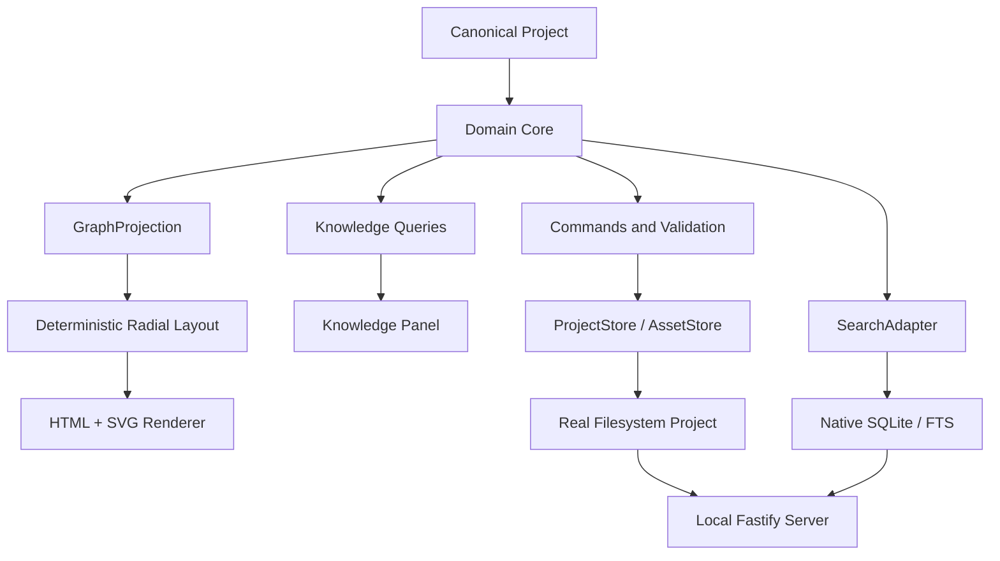

# Outmapper Architecture

## Purpose

Outmapper is designed around one architectural principle:

> The portable Project is the durable knowledge representation. Databases, indexes, caches, and renderers are replaceable mechanisms for operating on that Project.

This keeps runtime mechanisms replaceable without making any database, index, or renderer the product's source of truth.

## System layers



## Architectural principles

1. **Canonical state is portable.** Structured Project files and ordinary assets are authoritative.
2. **Runtime state is rebuildable.** SQLite databases, search indexes, document extraction caches, thumbnails, and graph indexes may be discarded and regenerated.
3. **The graph is a projection.** UI geometry never defines ontology or persisted relationships.
4. **The domain core is environment-independent.** Storage, browser, and filesystem concerns sit behind interfaces.
5. **Storage implementations preserve the same domain semantics.**
6. **Security boundaries treat Project content as untrusted data.**
7. **Accessibility and international text are architectural requirements.**
8. **Interactive graphs use HTML and SVG.** Layout and visual geometry remain separate from canonical Project data.

## Technology stack

Outmapper uses:

- TypeScript in strict mode;
- React for the application UI;
- Vite for application builds;
- Fastify as the local localhost server;
- ordinary Project folders on the real filesystem;
- native SQLite as derived runtime persistence and FTS;
- a custom HTML + SVG graph renderer;
- D3 Zoom for pan/zoom and D3 Force for the Universe layout;
- a custom deterministic radial layout;
- JSON Schema 2020-12 with Ajv for the portable Project contract;
- PDF.js in a Worker for supported PDF parsing and text extraction;
- zip.js for streaming ZIP/Zip64 transport.

Outmapper runs as a local CLI/browser application and stores Projects in ordinary filesystem folders.

Dependency versions are recorded in `package.json` and `package-lock.json`.

## Domain core

The environment-independent core owns:

- Project, Topic, KeyIssue, TopicRelationship, KnowledgeItem, KnowledgeAssociation, Asset, Collection, Theme, and PublishedSnapshot concepts;
- validation and invariants;
- graph projection;
- deterministic ordering inputs;
- commands and mutation semantics;
- publication semantics;
- import normalization contracts;
- search query semantics;
- schema migrations.

UI edits pass through the domain commands and local API before canonical Project data is saved.

## Commands and repositories

Mutations flow through domain commands and repositories:

```text
UI action
  -> domain command
  -> validation
  -> repository transaction
  -> canonical Project mutation
  -> derived runtime reconciliation
  -> refreshed GraphProjection / Knowledge queries
```

Representative commands include creating/updating Topics and Key Issues, connecting Topics through Key Issues, associating Knowledge Items, attaching assets, reordering authored content, and publishing a snapshot.

Repository interfaces expose domain operations; database queries remain within the storage adapters.

## GraphProjection

`GraphProjection` is the renderer-neutral view of the current Topic context. It includes enough information to render and semantically navigate:

- the central Topic;
- ordered Key Issues;
- unique Related Topics;
- explicit relationships between Key Issues and Related Topics;
- selection/highlight state;
- visibility/semantic-zoom hints;
- deterministic layout inputs;
- transition hints when moving Topic → Topic.

A Related Topic connected through several Key Issues appears once in the outer ring with several relationships.

## Renderer and layout

### Default renderer

The default visual renderer is:

```text
HTML interactive nodes / labels
+
SVG relationships / geometry
+
shared viewport transform
```

HTML is preferred for interactive labels because browser text shaping, wrapping, bidi handling, focus behavior, and accessibility are valuable at Outmapper's expected visible scale.

SVG handles curved relationships, selection geometry, highlights, fades, and halos.

### Layout

The layout is deliberately specialized:

- Ring 0: current Topic;
- Ring 1: ordered Key Issues;
- Ring 2: unique Related Topics.

The layout is deterministic for equivalent Project data and authored ordering inputs. Incidental screen coordinates are not canonical Project data.

Only the current GraphProjection is rendered, so total Project graph size does not directly determine the number of active DOM and SVG elements.

## Knowledge Panel

The Knowledge Panel queries the same selected Topic or Key Issue state as the map. It presents contextual content in sections such as:

- Pinned;
- Publications;
- Videos;
- Data;
- Notes;
- user-defined collections and tags.

There is one unified Knowledge experience. Timestamps remain metadata; the application does not provide a separate chronological panel mode.

Knowledge sections expand in the independently scrolling panel.

## Search abstraction

`SearchAdapter` exposes product semantics instead of engine syntax. The application searches Topics, Key Issues, Knowledge Item metadata/body text, supported extracted document text, tags, authors, and sources.

The local implementation uses SQLite FTS5. SearchAdapter keeps filters and user-facing query semantics independent from SQLite query syntax. Arabic and Russian normalization are verified by multilingual search checks.

All Projects search is federated rather than centralized. One long-lived worker visits the active Project first and then one selected registry instance per remaining Project in `lastOpenedAt` order. Every database is opened read-only, capped by an LRU of 32 connections, and accepted only when its search schema and Project ID match the registry. An older canonical revision remains searchable with a stale flag. Missing or incompatible runtimes are counted as unavailable until their Project is opened. Ranking uses title-match tiers and reciprocal rank within each tier, so SQLite BM25 values are never compared across databases. A 400 ms pass can return partial results plus a continuation; starting a newer query cancels the prior worker job through shared cancellation state.

## Storage adapters

### ProjectStore

Provides canonical Project read/write, revision, migration, and transaction-like commit semantics appropriate to the environment.

### AssetStore

Resolves stable asset IDs to Project-owned files and streams bytes without requiring large assets to be fully buffered in application memory.

### SearchAdapter

Indexes canonical content and returns normalized search results.

The interfaces separate domain behavior from filesystem, asset, and search implementations.

## Current local runtime

The complete local product runs as:

```text
browser UI on localhost
+
Fastify local server
+
real Project directory
+
native derived SQLite / FTS
```

The local server binds to loopback and exposes only the Project locations explicitly opened by the user.

Canonical files/assets live in ordinary Outmapper-managed Project directories. Native SQLite accelerates queries/search but remains rebuildable and noncanonical.

Core functionality runs without external internet access once the application is installed. The browser communicates with the local loopback server; external source links require internet access.

This architecture gives ordinary filesystem semantics for large Projects while reusing the browser UI.

## Workspace registry and ProjectReader

`<stateDirectory>/workspace/registry.json` is a machine-local registry, not part of any portable Project. Each folder instance has a stable `instanceId` and cached Project metadata, fingerprint, availability, recent/open timestamps, Home Topic/cover path and MIME information, and outgoing Project Links. Multiple folder instances can carry the same Project ID; a preferred instance or the most recently opened instance represents that Project in aggregate views.

`ProjectReader` refreshes non-active registry entries without acquiring their write lock, recovering files, creating runtime state, or rebuilding search. A stat/fingerprint sweep rereads only changed entries. Outmapper writes only the active Project; registry cache updates are the sole workspace-level mutation associated with other folders.

The incoming-link index is held in server memory and rebuilt after every registry write, including registration, refresh, location changes, copies, preference changes, and forget operations. It reverses cached outgoing links without writing backlinks to their targets. A missing or absent target Topic resolves to the target Project's current Home Topic when the endpoint is read.

The Universe is also derived entirely from registry cache. It selects one node per Project ID, retains unavailable nodes, reports duplicate instance counts, and aggregates directed link counts between Project pairs. Home covers are exposed only through a guarded route that resolves the cached Project-relative path, rejects symbolic links, sniffs PNG/JPEG/WebP bytes, and never serves SVG.

## Workspace APIs

All failures use `{ "error": string, "code": string }`; clients translate the stable `code` and retain the English `error` as fallback.

```text
GET /api/workspace/projects
-> { activeInstanceId, formatVersion, projects: { [instanceId]: WorkspaceProjectEntry }, preferredInstance }

POST /api/workspace/refresh
-> same shape after a stat sweep

GET /api/workspace/incoming
-> { projectId, total, groups: [{ topicId, links: [{
     linkId, sourceInstanceId, sourceProjectId, sourceProjectTitle,
     sourceTopicId, sourceTopicTitle, keyIssueId, keyIssueTitle, availability
   }] }] }

GET /api/workspace/universe
-> { nodes: [{ instanceId, projectId, title, description?, status,
     duplicateCount, homeTopicId?, homeTopicTitle?, coverUrl?, lastOpenedAt? }],
     edges: [{ id, sourceProjectId, targetProjectId, count }] }

GET /api/workspace/projects/:instanceId/home-cover
-> sniffed image bytes, or a coded 404/415 response

GET /api/search?q=...&scope=workspace&continuation=...
-> { items: SearchHit[], total, totalCapped?, incomplete?, continuation?,
     notSearchableCount?, staleProjectCount? }
```

Workspace navigation endpoints activate, locate, prefer, hide from Recent, forget, copy, or assign a new identity to a folder instance. Activation responses carry the canonical Project, per-instance history state, runtime reconciliation result, and active `instanceId`.

## Snapshot compatibility

The Project format and publication service retain Published Snapshot records and manifests for compatibility. A snapshot identifies a canonical revision and referenced Asset identities. The service retains the current snapshot plus the 10 most recent previous snapshots.

Viewer shows the current autosaved Working State. Studio edits that same state, and portable Project export backs it up together with retained snapshot manifests.

## Workers and background work

PDF extraction and All Projects search run in separate workers. Archive import and export stream files through the local server with bounded limits.

PDF extraction uses one long-lived Node Worker around PDF.js. Work is queued, bounded by byte/page/text/time limits, and written only to derived extraction records. Extraction failures never mutate canonical Knowledge or Asset records.

Federated workspace search uses a separate single worker and read-only SQLite connections. It never creates, migrates, reindexes, or writes runtime files in non-active Projects.

## Reliability and recovery

Outmapper uses:

- autosaved working state;
- session undo/redo;
- recovery checkpoints;
- migration backups;
- explicit Project backups;
- Published Snapshots;
- revision markers to detect canonical/runtime divergence.

Runtime databases and extracted text are rebuilt from canonical data when missing or incompatible.

The local filesystem adapter checkpoints an in-progress canonical save under the Project's derived `.outmapper/` directory. Reopening the Project completes a valid pending checkpoint before reading canonical records. Saves and recovery take the folder's write lock; plain reads do not. A read waits for any save in flight in the same process, hashes exactly the bytes it parsed and compares them with the files on disk, and re-checks for a checkpoint afterwards, so a read can never collide with a save or a Project switch, and a read that overlaps another process's write (including one paused part-way) falls back to the locked recovery path. The native SQLite/FTS database also lives under `.outmapper/`; its Project ID and canonical revision markers determine whether it is current or must be rebuilt.
