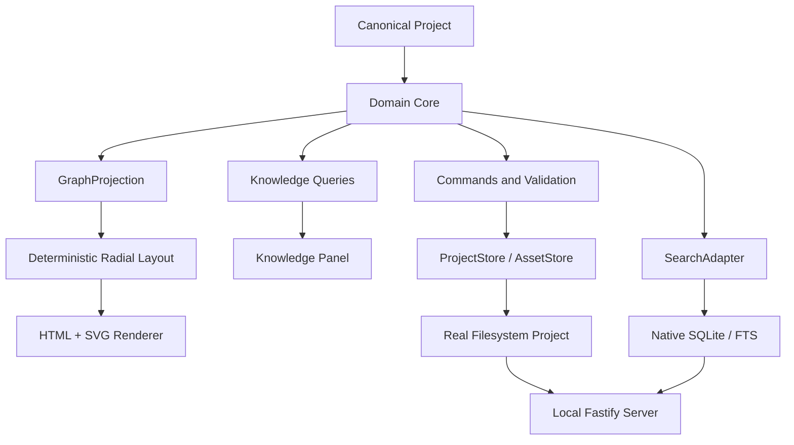

# Outmapper Architecture

## Purpose

Outmapper is designed around one architectural principle:

> The portable Project is the durable knowledge representation. Databases, indexes, caches, and renderers are replaceable mechanisms for operating on that Project.

This keeps runtime mechanisms replaceable without making any database, index, or renderer the product's source of truth.

## System layers



The diagram describes the current implementation.

## Architectural principles

1. **Canonical state is portable.** Structured Project files and ordinary assets are authoritative.
2. **Runtime state is rebuildable.** SQLite databases, search indexes, document extraction caches, thumbnails, and graph indexes may be discarded and regenerated.
3. **The graph is a projection.** UI geometry never defines ontology or persisted relationships.
4. **The domain core is environment-independent.** Storage, browser, and filesystem concerns sit behind interfaces.
5. **Storage implementations preserve the same domain semantics.**
6. **Security boundaries treat Project content as untrusted data.**
7. **Accessibility and international text are architectural requirements.**
8. **Renderer changes require measured evidence.** HTML and SVG are the current rendering baseline.

## Technology baseline

The current Outmapper implementation baseline uses:

- TypeScript in strict mode;
- React for the application UI;
- Vite for application builds;
- Fastify as the local localhost server;
- ordinary Project folders on the real filesystem;
- native SQLite as derived runtime persistence and FTS;
- a custom HTML + SVG graph renderer;
- D3 Zoom as a low-level pan/zoom interaction primitive;
- a custom deterministic radial layout;
- JSON Schema 2020-12 with Ajv for the portable Project contract;
- PDF.js in a Worker for supported PDF parsing and text extraction;
- zip.js for streaming ZIP/Zip64 transport.

The current release is a local CLI/browser application. Hosted deployment, browser-owned Project storage, desktop wrappers, and executable plugins are outside its implementation boundary.

Framework and dependency versions belong in implementation manifests, not this durable architecture document.

## Domain core

The environment-independent core owns:

- Project, Topic, KeyIssue, TopicRelationship, KnowledgeItem, KnowledgeAssociation, Asset, Collection, Theme, and PublishedSnapshot concepts;
- validation and invariants;
- graph projection;
- deterministic ordering inputs;
- commands and mutation semantics;
- publication semantics;
- import normalization contracts;
- search query semantics;
- schema migrations.

UI code must not directly mutate renderer arrays or runtime database tables.

## Commands and repositories

Mutations flow through domain commands and repositories:

```text
UI action
  -> domain command
  -> validation
  -> repository transaction
  -> canonical Project mutation
  -> derived runtime reconciliation
  -> refreshed GraphProjection / Knowledge queries
```

Representative commands include creating/updating Topics and Key Issues, connecting Topics through Key Issues, associating Knowledge Items, attaching assets, reordering authored content, and publishing a snapshot.

Repository interfaces must describe domain behavior rather than expose database-specific queries.

## GraphProjection

`GraphProjection` is the renderer-neutral view of the current Topic context. It includes enough information to render and semantically navigate:

- the central Topic;
- ordered Key Issues;
- unique Related Topics;
- explicit relationships between Key Issues and Related Topics;
- selection/highlight state;
- visibility/semantic-zoom hints;
- deterministic layout inputs;
- transition hints when moving Topic → Topic.

A Related Topic connected through several Key Issues appears once in the outer ring with several relationships.

## Renderer and layout

### Default renderer

The default visual renderer is:

```text
HTML interactive nodes / labels
+
SVG relationships / geometry
+
shared viewport transform
```

HTML is preferred for interactive labels because browser text shaping, wrapping, bidi handling, focus behavior, and accessibility are valuable at Outmapper's expected visible scale.

SVG handles curved relationships, selection geometry, highlights, fades, and halos.

### Layout

The layout is deliberately specialized:

- Ring 0: current Topic;
- Ring 1: ordered Key Issues;
- Ring 2: unique Related Topics.

The layout is deterministic for equivalent Project data and authored ordering inputs. Incidental screen coordinates are not canonical Project data.

Only the current GraphProjection is rendered, so total Project graph size does not directly determine the number of active DOM and SVG elements.

## Knowledge Panel

The Knowledge Panel queries the same selected Topic or Key Issue state as the map. It presents contextual content in sections such as:

- Pinned;
- Publications;
- Videos;
- Data;
- Notes;
- user-defined collections and tags.

There is one unified Knowledge experience. Timestamps remain metadata; the application does not provide a separate chronological panel mode.

Long content lists should be paged or virtualized independently of graph rendering.

## Search abstraction

`SearchAdapter` exposes product semantics instead of engine syntax. The application should support queries across Topics, Key Issues, Knowledge Item metadata/body text, supported extracted document text, tags, authors, sources, and provided transcripts/captions.

The local implementation uses SQLite FTS5. SearchAdapter keeps filters and user-facing query semantics independent from SQLite query syntax. Arabic and Russian normalization are covered by multilingual search fixtures.

## Storage adapters

### ProjectStore

Provides canonical Project read/write, revision, migration, and transaction-like commit semantics appropriate to the environment.

### AssetStore

Resolves stable asset IDs to Project-owned files and streams bytes without requiring large assets to be fully buffered in application memory.

### SearchAdapter

Indexes canonical content and returns normalized search results.

These interfaces are extension seams, not a downloadable executable plugin system.

## Current local runtime

The complete local product runs as:

```text
browser UI on localhost
+
Fastify local server
+
real Project directory
+
native derived SQLite / FTS
```

The local server binds to loopback and exposes only the Project locations explicitly opened by the user.

Canonical files/assets live in ordinary Outmapper-managed Project directories. Native SQLite accelerates queries/search but remains rebuildable and noncanonical.

The local runtime must continue to provide all core functionality when external internet access is unavailable. Localhost communication is part of the application runtime and is not considered an external network dependency.

This architecture gives ordinary filesystem semantics for large Projects while reusing the browser UI.

## Publication

Authoring follows:

```text
Working State -> Preview -> Published Snapshot
```

A Published Snapshot identifies an immutable canonical revision and immutable asset identities. Snapshots do not duplicate multi-GB asset bytes when the same immutable asset can be referenced safely.

The default retention target is the current Published Snapshot plus the 10 most recent previous Published Snapshots.

## Workers and background work

CPU-heavy or blocking tasks should leave the interactive main thread where platform support allows, especially:

- index rebuilds;
- PDF extraction;
- archive processing;
- expensive document parsing.

PDF extraction uses one long-lived Node Worker around PDF.js. Work is queued, bounded by byte/page/text/time limits, and written only to derived extraction records. Extraction failures never mutate canonical Knowledge or Asset records.

## Reliability and recovery

Outmapper uses:

- autosaved working state;
- session undo/redo;
- recovery checkpoints;
- migration backups;
- explicit Project backups;
- Published Snapshots;
- revision markers to detect canonical/runtime divergence.

Runtime corruption should be recoverable by rebuilding from canonical data.

The local filesystem adapter checkpoints an in-progress canonical save under the Project's derived `.outmapper/` directory. Reopening the Project completes a valid pending checkpoint before reading canonical records. The native SQLite/FTS database also lives under `.outmapper/`; its Project ID and canonical revision markers determine whether it is current or must be rebuilt.
